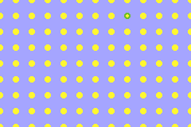

# Exploration 1: Bubble Wrap

In our first exploration we will be making a little game where we've got a grid of bubbles, and we can pop them one by one with a satisfying little popping sound.

Here's what mine ended up looking like, but you always have the freedom to experiment and make yours your own!

## What we will learn?
 - Core Butano setup and loop
 - Backdrop settings
 - Sprite basics
    - creating
    - positioning
    - scaling
    - graphics indexing
    - sprite limits
 - LibreSprite spritesheets
 - C arrays vs `bn::array` vs `bn::vector`
 - Nested arrays and nested loops
 - Logging with BN_LOG

It's gonna be a fun one! What are you waiting for? Let's go!

