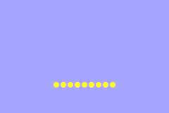

# Loops and Arrays

In this section we'll be exploring a few different ways to make lines of sprites.

## Making room for new art

In this section we'll be needing a bit of space to draw, and so we'll have to clear out your old art. But let's not forget it! You can comment out your code to make it temporarily unexecuted. Highlight all the lines where you are creating sprite pointers and then `ctrl-/` (`cmd-/`) on Mac. This will turn all of the hilighted lines into comments. Want to uncomment it? Just highlight them again and use the same shortcut.


The actual best way to keep your old art would be to have a separate git branch with your old art and to clear it out of the main branch. We'll talk more about branches later.
{: .note}

## Our goal

We'll be making lines of sprites that look similar to this:



## Brute forcing it

One way to achieve this would be to simply make a new named variable for every sprite we want:

```cpp
bn::sprite_ptr myCircle = bn::sprite_items::dot.create_sprite(-40, 40);
bn::sprite_ptr myCircle2 = bn::sprite_items::dot.create_sprite(-30, 40);
bn::sprite_ptr myCircle3 = bn::sprite_items::dot.create_sprite(-20, 40);
bn::sprite_ptr myCircle4 = bn::sprite_items::dot.create_sprite(-10, 40);
bn::sprite_ptr myCircle5 = bn::sprite_items::dot.create_sprite(0, 40);
bn::sprite_ptr myCircle6 = bn::sprite_items::dot.create_sprite(10, 40);
bn::sprite_ptr myCircle7 = bn::sprite_items::dot.create_sprite(20, 40);
bn::sprite_ptr myCircle8 = bn::sprite_items::dot.create_sprite(30, 40);
bn::sprite_ptr myCircle9 = bn::sprite_items::dot.create_sprite(40, 40);
```

The y value stays the same, but the x value goes from -40 to 40, increasing by 10 each time. Go ahead and give it a try! Make your code and run it and verify you get what we expect. 

Not working? Make sure that you commented out your old sprites and that you didn't accidentally comment out anything important like the init or while loop.
{:error}

We've got something working, so go ahead and add/commit/push.

## A better way: loops

That works, but it's fairly rendanduant code. If we decided we wanted to move everything 10 pixels to the right, we'd need to edit every single one of those 10 lines! It would be even worse if we had more sprites.

Instead, let's try to do this using a for-loop instead. A for loop allows us to specify some code to be repeatedly executed. We keep track of how many times to execute the loop using a variable. We specify what the variable should start at, where it should end at, and by how much the variable should change at each iteration of the loop.

for loops are actually a bit more flexible than this, but this is a common pattern we'll start with.
{: .note}

Comment out your old manual sprite pointers, and replace it with the below instead. Spoiler: this will not 100% work, but it'll get us close:

```
for(int x = -40; x <= 40; x += 10) {
    bn::sprite_ptr myCircle = bn::sprite_items::dot.create_sprite(x, 40);
}
```

We're telling our code:
- Start our x value at -40
- Keep on looping while x is less than or equal to positive 40
- Increase x by 10 at each iteration
- Create a sprite pointer called `myCircle` at position `(x, 40)` at each iteration

So we might hope that this would give us a bunch of sprites, each spaced out from one another. But compile and run your code and see what we actually get.


Not compiling? If you had modified your code to use the myCircle variable later, your code won't compile. Comment out any lines using myCircle other than the one in the for-loop for now. 
{: .error}

## Debugging

Unfortunately, when we run our code we end up getting nothing! No sprites show up. Let's try to debug.

It's hard to tell exactly what's going wrong at first. We'll try to break our code down and verify what parts *are* working until we find parts that *aren't*. Our first thought might be that we set our for-loop up wrong. Maybe it's not running at all, or giving values for x that are way different than what we expect. Let's meet our first debugging tool to help us figure out whether that's the case.

## BN_LOG

One of the best tools for debugging in Butano is `BN_LOG`. This macro allows us to display debugging output when running in mGBA or EmulatorJS. It's similar to a print statement in other languages or `std::cout` in C++. We can use it in this case to print out the value of x at each iteration of the loop. We're hoping to see it go `-40, -30, -20, ... 30, 40`

To use `BN_LOG` we need to first have an include:

```cpp
#include <bn_log.h>
```

And then let's add this *inside* our for loop:

```cpp
BN_LOG("x value", x);
```

> Why not std::out?
>
> If you've programmed in C++ before you might be used to lines like this:
>
> ```cpp
> std::cout << "Hello, World!" << std::endl;
> ```
> 
> So why aren't we doing that here? The answer is that when we're programming for the GBA we typically won't be using anything from `std`. `std` makes a lot of assumptions about the computer we're running on, and and those assumptions are often not well suited for the Game Boy Advance. Thankfully, Butano offers many replacements to code from `std` that we can use instead. `BN_LOG` is a great replacement for `std::cout`.
{: .question}

Make your code and run it in mGBA. Then, to see the debug output click Tools > View logs. You should expect to see something like this:

```
[WARN] GBA Debug:	x value: -40
[WARN] GBA Debug:	x value: -30
[WARN] GBA Debug:	x value: -20
[WARN] GBA Debug:	x value: -10
[WARN] GBA Debug:	x value: 0
[WARN] GBA Debug:	x value: 10
[WARN] GBA Debug:	x value: 20
[WARN] GBA Debug:	x value: 30
[WARN] GBA Debug:	x value: 40
```

It looks like our for-loop is running properly, but our sprites aren't showing up! What gives?

## Scoping and smart pointers

The sprites don't show up as a result of two reasons:

1. C++ is a *block-scoped* language. When we declare a variable inside a block (like a for-loop), that variable only exists during that block. Afterwards it is *out of scope* and automatically removed. 
1. `sprite_ptr`s are *smart pointers*, specifically shared pointers. This means that once there are no more variables that point to the sprite, the sprite will be automatically removed.

So our loop repeatedly creates a sprite, but then throws it away because the sprite pointer goes out of scope. By the time we get to our while loop, the sprites are all gone and nothing gets displayed. We need some way of keeping our sprite pointers around!


