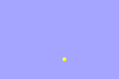
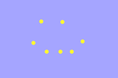

# Intro to Sprites

In this section we'll start to explore **sprites** one of the core graphical concepts of the Game Boy Advance. You can think of a sprite as a small that the Game Boy is able to render to the screen. The Game Boy advance hardware has support for quickly rendering and moving many sprites, as well as rotating, scaling, and otherwise transforming some sprites. When we work with the Game Boy Advance graphics, we'll mostly be working with **sprites** and **backgrounds** because of the hardware-accelerated support for these types of graphics.

It's not just at the software level! There is actual hardware-level support hard-wired into the Game Boy Advance for dealing with sprites and backgrounds. 
{: .note}

> Are there non-sprite ways to make graphics using the Game Boy Advance?
>
> Yes, there are other modes that the GBA supports for making graphics that aren't sprite based, namely bitmap modes. These however are much less commonly used because the rendering needs to happen on the software side. The vast majority of Game Boy Advance games make heavy use of sprites.
{: .question}

## Files needed for a sprite

To make a sprite in Butano, we use two files: a BMP and a JSON file. In the bubble-wrap repo you forked there is already a sprite set up. You can see the files under the `graphics` directory. Take a look at `dot.bmp` and `dot.json` now! What do you see?

Any time you want to add a new sprite, you'll need to make a new BMP AND a new JSON file. It won't work without the JSON!


## Image requirements

As of Butano 21.0.0, there are a number of requirements for images to be imported as sprites. For authoritative details on what's required, see Butano's [Importing Assets page](https://gvaliente.github.io/butano/import.html). There's A LOT in there though, so I'll summarize the most important parts for our purposes below.

### Images must be plain bmps

Butano requires a very specific format: BMPs that
- are uncompressed
- have no color space information
- have 16 or 256 colors in the palette

Most image editors or BMPs you find on the internet will not work due to these constraints. That's part of why we're using LibreSprite (particularly in indexed mode): because it handles all the formatting we need and makes editing palettes easy.

> What about Usenti?
>
> The Butano docs recommend using [Usenti](https://github.com/gb-archive/usenti) to edit sprites. This is a great option, but it unfortunately is Windows-only. To make this tutorial cross-platform we'll be using LibreSprite, but feel free to use Usenti instead if you prefer it.
{: .question}

> OK, what about Aseprite then?
>
> LibreSprite is actually a fork of another sprite editor called [Aseprite](https://www.aseprite.org/). Aseprite used to be fully free open-source software, but it is no longer. You can buy it, or use it for free if you choose to compile from source. It is more-fully featured that LibreSprite, and might be a bit nicer to work with. But to keep things FOSS for this guide and to avoid needing to do a full buoild of a sprite editor, the instructions here will be for LibreSprite. That being said, feel free to use Aseprite if you are willing to pay for it or compile.
{: .question}

## Image JSON files
Each image needs an accompanying JSON file to tell Butano how to use the image. There are A LOT of different attributes you can put here (again look at Butano's [Importing Assets page](https://gvaliente.github.io/butano/import.html) if you want full details), but we'll just focus on a few for now.

- **type** specifies how Butano should use this image. Is it a sprite? A background? Just a palette?
- **height** specifies how tall a sprite is

> Why do we need to specify the height? Can't Butano tell from the image itself?
>
> The reason we need to specify the height is because we we will end up including multiple sprite images in a single bmp. This will be valuable for showing different versions of a sprite, like a selected/unselected button or multiple frames of a walking animation. The height will tell Butano how tall each individual sub-image is so that Butano can cleanly separate them. LibreSprite will help us with making spritesheets that hold multiple sub-images.
{: .question}

## Sprite Items

If we've successfully added an image file with `"type": "sprite"`, we'll be able to start using it in our game.

Let's start by adding two include statements to the top of our file:

```cpp
#include <bn_sprite_ptr.h>
#include <bn_sprite_items_dot.h>
```

### `bn_sprite_ptr.h`

`bn_sprite_ptr.h` holds information on `bn::sprite_ptr`s (sprite pointers), which are the main way we'll interact with sprites in Butano. It will give us functions to get/set the position, rotation, size, etc. of sprites and will handle ownership of the sprite data. `bn_sprite_ptr.h` is a standard part of the Butano library. Learn more about it on Butano's [documentation for bn::sprite_ptr](https://gvaliente.github.io/butano/classbn_1_1sprite__ptr.html).

> What is a `sprite_ptr` actually?
>
> In C++ we have 4 main ways of holding variables or locations of variables:
> - Values
> - References
> - Raw Pointers
> - Smart Pointers
> A `sprite_ptr` is a type of smart pointer. If you're familiar with smart pointers in C++, it acts similarly to `std::shared_ptr` with the same ownership and freeing rules. If you're not familiar with these ways of holding data, don't despair! We'll spend a lot of time in coming tutorials exploring these different patterns and what they mean.
{:. question}

### `bn_sprite_items_dot.h`

`bn_sprite_items_dot.h` has information about the particular dot sprite created from `dot.bmp` in our `bubble-wrap` repository. When Butano sees a valid image and JSON it creates a corresponding `bn_sprite_items_IMAGE_NAME.h` file as part of our make step (where `IMAGE_NAME` is the name of the BMP file).


> Red squiggles with new images
> 
> When you first attempt to add a new sprite, you might see VS Code underline the `#include <bn_sprite_items_IMAGE_NAME.h>` in red and tell you and it can't find the file. This is because the `bn_sprite_items_IMAGE_NAME.h` file does not get created until AFTER `make` has run for the first time. After the `make` succeeds the red squiggle should go away.
{: .error}

## Making a sprite

Let's actually put a sprite on the screen! Put this code AFTER your init, but before your while loop:

```
bn::sprite_ptr myCircle = bn::sprite_items::dot.create_sprite(10, 40);
```

We need to put this line after the init because we're not allowed to do anything with Butano until `bn::core::init()` is called. We put the line before the while because we only want create the sprite once. Sprites will stick around until there are no longer any variables that point to them; they don't need to be recreated every frame.
{: .note}

`make` your code, run it in mGBA and you should see your sprite appear on the screen! If your backdrop color is a yellow similar to the dot, it might be hard to see. Consider changing your backdrop to something else for now if needed.



### Experimenting with location

Try increasing/decreasing the 10 and 40 in the `create_sprite` call. Where does the dot move? What are the minimum and maximum values to keep the dot on-screen?

Try making a second dot variable `myCircle2` with new coordinates. Try making a 3rd and a 4th! Can you make a picture that looks something like this?

